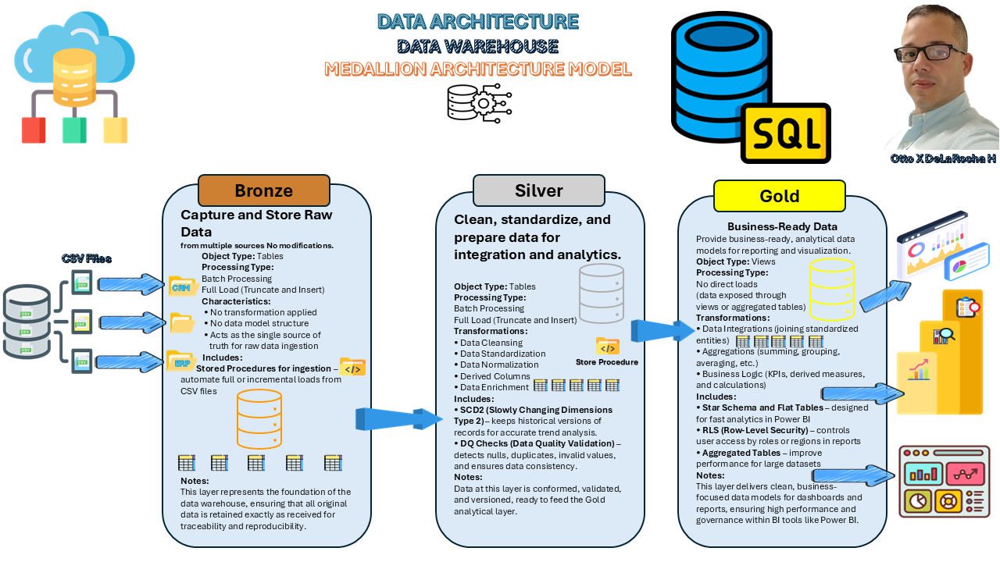

SQL Data Warehouse Project

Building a Modern Data Warehouse Using SQL Server, ETL, Data Modeling, and Analytics

📘 Project Overview

This repository demonstrates a complete data warehousing and analytics solution — from raw data ingestion to business-ready dashboards.
The project reflects my ongoing learning and practice in data engineering, data architecture, and analytics, using real-world concepts applied through SQL Server Management Studio (SSMS), ETL processes, and Power BI visualizations.

The goal is to strengthen technical proficiency in designing, transforming, and modeling data while showcasing practical, end-to-end understanding of the Medallion Architecture:

Bronze Layer – Ingesting and storing raw source data.

Silver Layer – Cleaning, standardizing, and transforming data for analysis.

Gold Layer – Creating business-ready models (fact and dimension tables) for reporting and decision-making.

⚙️ Key Skills Applied

SQL Development & SSMS – Writing optimized queries, joins, and stored procedures.

ETL Pipelines – Extracting, transforming, and loading data for structured analysis.

Data Modeling – Implementing star schema structures for efficient analytics.

Data Architecture – Applying Medallion (Bronze–Silver–Gold) design principles.

Dynamic Reporting – Developing interactive dashboards in Power BI and Excel.

Data Analysis – Interpreting metrics, performance, and trends for stakeholders.

Front-End Support – Using HTML and CSS to document and present results professionally.

<h2 style="border-bottom:none; margin-bottom:10px;">🧩 Repository Structure</h2>

<table style="border-top:none; border-collapse:collapse;">

  <tr>
    <th>Folder / File</th>
    <th>Description</th>
  </tr>

  <tr>
    <td><b style="color:#cd7f32;">datasets/</b></td>
    <td>📊 Raw and cleaned datasets used in the project</td>
  </tr>

  <tr>
    <td><b style="color:#4682b4;">documents/</b></td>
    <td>📂 Project documentation, models, and diagrams</td>
  </tr>

  <tr>
    <td>&nbsp;&nbsp;↳ 🖼️ data_architecture.png</td>
    <td>System architecture diagram</td>
  </tr>
  <tr>
    <td>&nbsp;&nbsp;↳ 📘 data_catalog.md</td>
    <td>Metadata and data definitions</td>
  </tr>
  <tr>
    <td>&nbsp;&nbsp;↳ 🧩 data_models.png</td>
    <td>Entity-relationship and dimensional models</td>
  </tr>
  <tr>
    <td>&nbsp;&nbsp;↳ 🏷️ naming-conventions.md</td>
    <td>Standards for naming tables, columns, and files</td>
  </tr>

  <tr>
    <td><b style="color:#cd7f32;">scripts/</b></td>
    <td>⚙️ SQL scripts for each architecture layer</td>
  </tr>
  <tr>
    <td>&nbsp;&nbsp;↳ 🥉 bronze/</td>
    <td>Raw data ingestion</td>
  </tr>
  <tr>
    <td>&nbsp;&nbsp;↳ 🥈 silver/</td>
    <td>Data transformation and cleaning</td>
  </tr>
  <tr>
    <td>&nbsp;&nbsp;↳ 🥇 gold/</td>
    <td>Data modeling for analytics</td>
  </tr>

  <tr>
    <td><b style="color:#2e8b57;">reports/</b></td>
    <td>📊 Power BI and Excel dashboards</td>
  </tr>

  <tr>
    <td>README.md</td>
    <td>🧾 Project overview (this file)</td>
  </tr>

  <tr>
    <td>LICENSE</td>
    <td>⚖️ Project license (MIT License)</td>
  </tr>
</table>

🎯 Learning Objectives

Strengthen data engineering and data architecture skills through hands-on projects.

Apply naming conventions, data normalization, and data enrichment methods.

Design reusable ETL and SQL workflows for continuous improvement.

Create dynamic dashboards that convert raw data into actionable insights.

🌟 About This Project

This project represents my independent practice and growing expertise in data analytics, ETL development, and data modeling.
It combines a professional understanding of SQL-based data transformation with visualization skills in Power BI and Excel.
I continue to expand my knowledge of data architecture, governance, and automation, focusing on scalable and maintainable design principles.

🛡️ License

This project is licensed under the MIT License.
You are welcome to use or adapt it for your own learning and exploration.

👤 Profile Summary

Hi, I'm Otto De La Rocha — a data professional with strong hands-on experience in SQL Server Management Studio (SSMS), ETL, Excel, and Power BI.
I enjoy designing and automating data solutions that turn raw information into useful insights for decision-making.
My work blends data analytics, data engineering, and data architecture concepts, while continuously strengthening and refining technical depth.
I have advanced experience in SSMS and am steadily expanding my proficiency in .NET MVC, Bootstrap, and integrating Visual Studio with SQL Server to develop cohesive, full-stack data solutions.
I also use HTML and CSS for clear, structured presentation of data and documentation.
I’ve learned a lot from data professionals and YouTubers who generously share their projects and experiences. 
Their content has helped me grow and inspired me to keep improving through practice and curiosity.

*Figure: SQL Data Warehouse Medallion Architecture — Bronze, Silver, and Gold Layers.*

### 🧠 ETL Architecture (Created in Microsoft Visio)

This diagram represents the Extraction, Transformation, and Loading (ETL) workflow that I designed and built from scratch in Microsoft Visio.  
It highlights extraction types and techniques, transformation logic, and load methods used in data warehousing processes.

> 🧩 Created in Microsoft Visio (A4 landscape, 300 DPI). This diagram demonstrates understanding of ETL concepts and data pipeline design.
